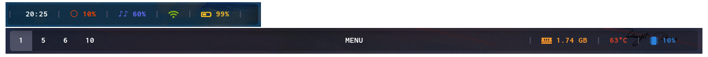
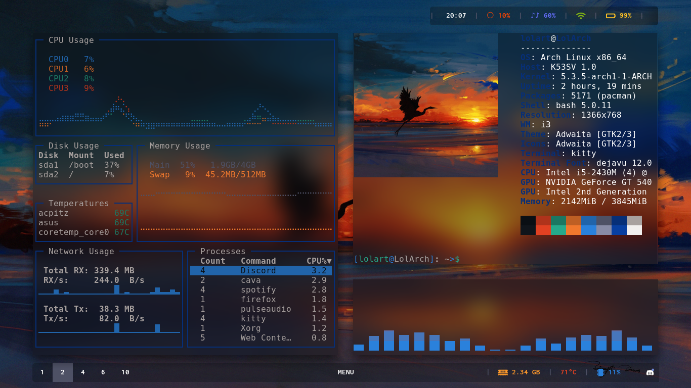
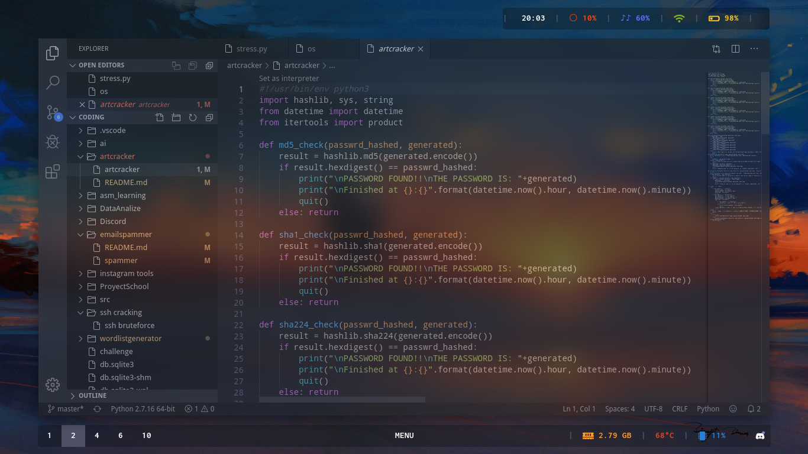
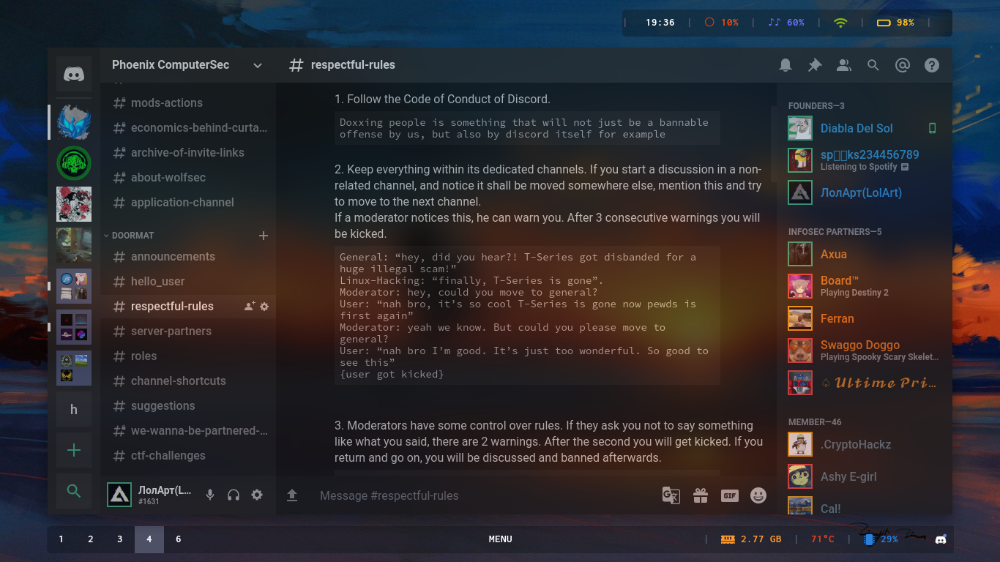
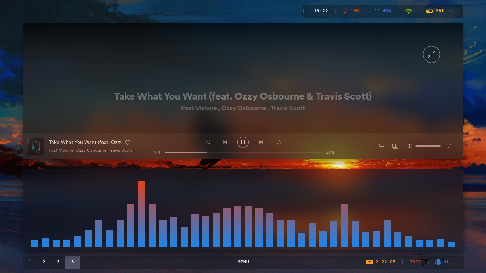

# sunset-setup

This desktop has taken more than 20 hours to make it. (give a star and share pls)

## The setup
### Polybar


### Kitty


### Visual Studio Code


### Discord

Btw, join this discord servers: [Phoenix ComputerSec](https://discord.gg/28VHRbE) and [Evilicious](https://discord.gg/hr2kzjz)

### Firefox


### Spotify + Cava


## How to setup
Write this in the terminal
```
cd ~/Downloads/
git clone https://github.com/lilart/sunset-setup
sudo mv sunset-setup/.config/* ~/.config/
sudo rm -R ../sunset-setup
```
If there is the error "*mv: cannot move 'sunset-setup/.config/' to '~/.config/': Not a directory*" do:
```
sudo mkdir ~/.config/
cd ~/Downloads/
git clone https://github.com/lilart/sunset-setup
sudo mv sunset-setup/.config/* ~/.config/
sudo rm -R ../sunset-setup
```

### Stuff to install
- yay
```
sudo pacman -S yay
```
- i3-gaps
```
sudo pacman -S i3-gaps
```
- polybar
```
yay -S polybar
```
- [custom Compton](https://github.com/tryone144/compton)
- Kitty
```
sudo pacman -S kitty
```
- Firefox
```
sudo pacman -S firefox
```
- Visual Studio Code Insiders
```
sudo pacman -S yay
yay -S visual-studio-code-insiders
```
- Cava
```
yay -S cava
```
- Spotify
```
yay -S spotify
```
- Discord
```
yay -S discord betterdiscord
```
- Fonts
```
 yay -S inconsolata-psf-git siji-git
 sudo pacman -S ttf-font-awesome 
```
### Other stuff to do
- Set up firefox css file
[Follow this instructions to create the file](https://www.userchrome.org/how-create-userchrome-css.html) and add the following code to userChrome.css
```
@namespace url("http://www.mozilla.org/keymaster/gatekeeper/there.is.only.xul");

:root:not([customizing]) #nav-bar toolbarbutton
 {
    margin-left: -28px !important;
    opacity: 0 !important;
    transform: scale(.85, .85) !important;
    pointer-events: none !important;
    transition: all 100ms var(--animation-easing-function) !important;
}

:root:not([customizing]) :hover > #nav-bar toolbarbutton,
:root:not([customizing]) #navigator-toolbox:focus-within #nav-bar toolbarbutton,
:root:not([customizing]) :hover > #titlebar toolbarbutton {
    transform: scale(1, 1) !important;
opacity:1 !important;
margin-left:0 !important;
pointer-events: auto !important;
}

#nav-bar {
    height: 0px;
    opacity: 0;
    overflow: hidden;
}

/* #nav-bar:hover, */
#nav-bar:focus-within {
    height: auto;
    opacity: 1;
    overflow: visible;
}

#navigator-toolbox::after {
	border-bottom: 0px !important;
}

/* don't show the blue border around the url bar when focused */
#urlbar, .searchbar-textbox {
  font-size: 12pt !important;
  border: none !important;
  box-shadow: none !important;
}

/* hide the one pixel top border for tabs */
.tab-background {
       border-top: none !important;
}

/* no blue line on top of the focused tab */
#tabbrowser-tabs {
       --tab-line-color: -moz-win-accentcolor !important;
       --tab-loading-fill: -moz-win-accentcolor !important;
box-shadow: none !important;
}


/* hide tabs entirely if there's only one */
/*
#tabbrowser-tabs, #tabbrowser-tabs arrowscrollbox { min-height: 0 !important; }
#tabbrowser-tabs tab { height: var(--tab-min-height); }
#tabbrowser-tabs tab:first-child:last-child { display: none !important; }
*/

/* hide tab bar if only one tab */
tab:only-of-type { 
    display:none; 
}

/* unset the tab bar min-height */ 
#tabbrowser-tabs, #tabbrowser-tabs > .tabbrowser-arrowscrollbox, #tabbrowser-tabs[positionpinnedtabs] > .tabbrowser-tab[pinned] {
    min-height: initial !important;
}

/* set the height on the tabs instead */
tab { 
    line-height: 32px; height: 32px; 
}

/* hide new tab button so tab-bar can collapse */
.tabs-newtab-button { 
    display: none; 
}

/* ...but show it on tab-bar hover */
#tabbrowser-tabs:hover .tabs-newtab-button { 
    display: block; 
}
```
- Install Visual Studio Code color theme
You can find how clicking [here](https://marketplace.visualstudio.com/items?itemName=akamud.vscode-theme-onedark)

-If polybar is looking strange for you:
edit width and offset-x values in polybar config files.

## Keyboard Shortcuts

- start a terminal(kitty)
$mod+Enter

- start firefox
$mod+Shift+f

- start discord
$mod+d

- start visual studio code
$mod+c

- start spotify
$mod+m

- start file manager(qtfm)
$mod+Shift+a

- Close focused window
$mod+Shift+q

- screenshot
$mod+Shift+p

- change brightness
$mod+o to make the brightness higher
$mod+i to make the brightness lower

## Resources
- [i3-sunset2](https://github.com/Vista1nik/i3-sunset2) 
- [Wallpaper](https://w.wallhaven.cc/full/13/wallhaven-132wqw.jpg)
- [Firefox custom CSS](https://www.reddit.com/r/FirefoxCSS/comments/dgl5n6/the_seamlessborderless_get_out_of_my_way_config/)
